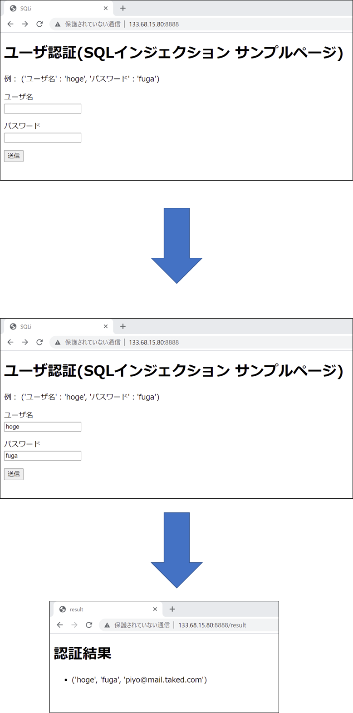
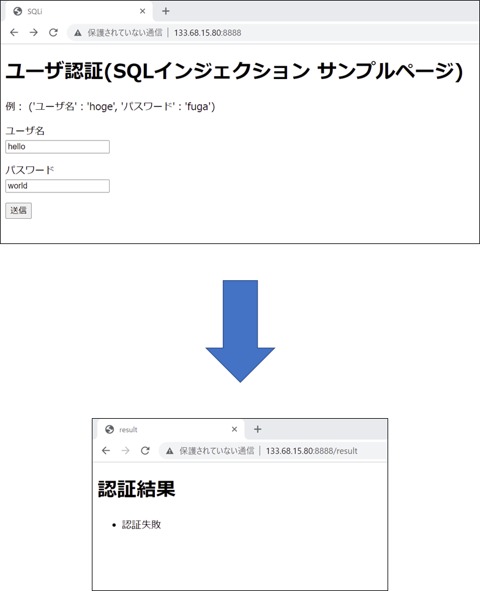
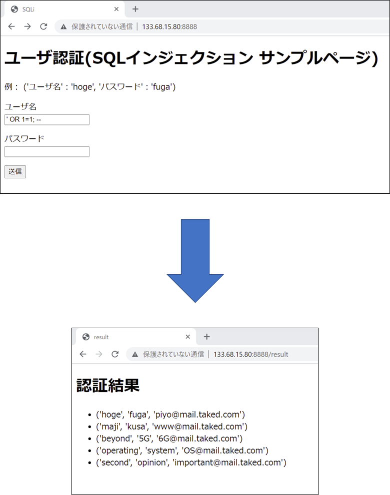

# SQL Injection

## 概要
- SQL Injectionを引き起こす簡易的なサンプルページ
- 使用技術
  - HTML
  - Python
  - Tornado
  - SQLite3

## 使い方
- 認証を行う構文
  - `select * from security where name='$name' AND password='$password'`
- SQL Injectionを引き起こすためにユーザ名に以下を入力
  - `' OR 1=1; --`

## スクリーンショット

### 通常の認証

### 認証失敗時

### SQL Injection成功時

